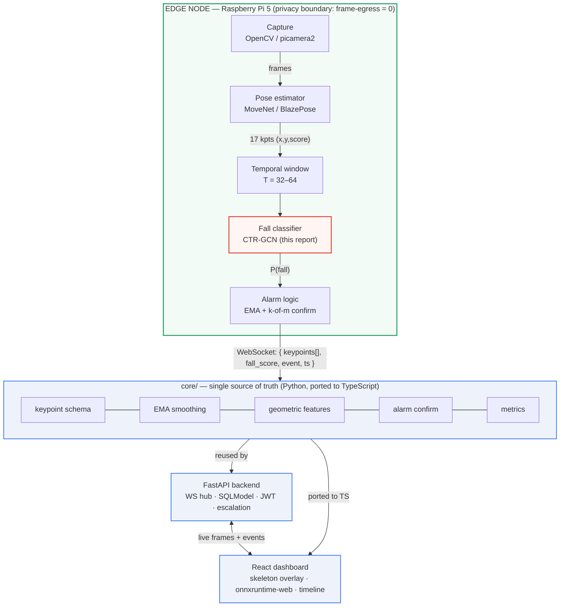
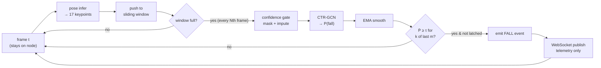
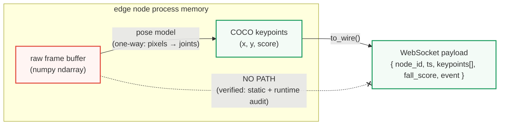
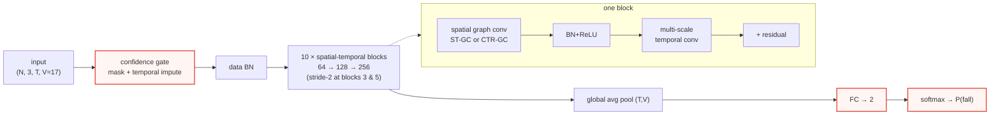
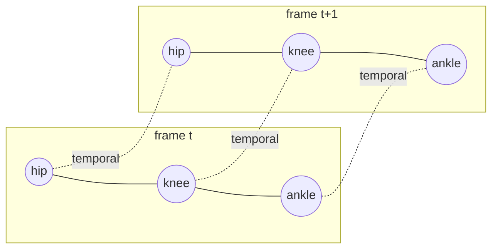
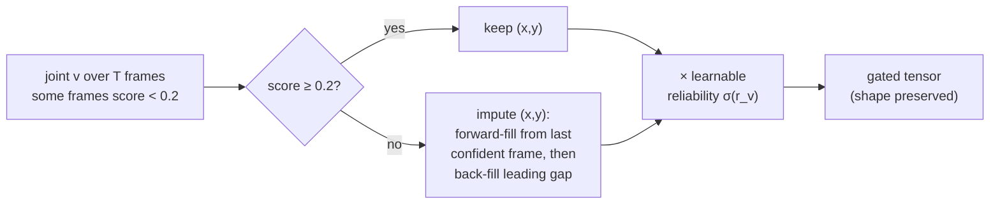
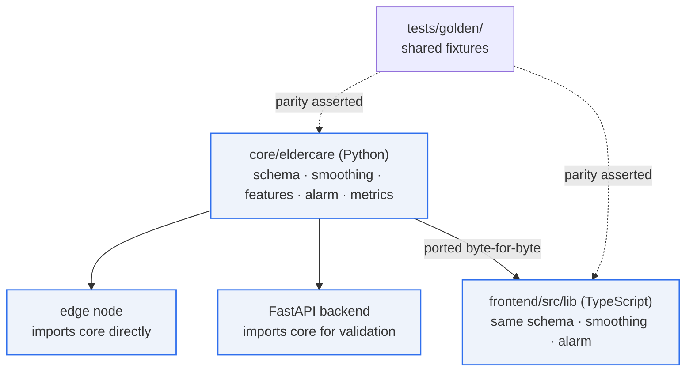
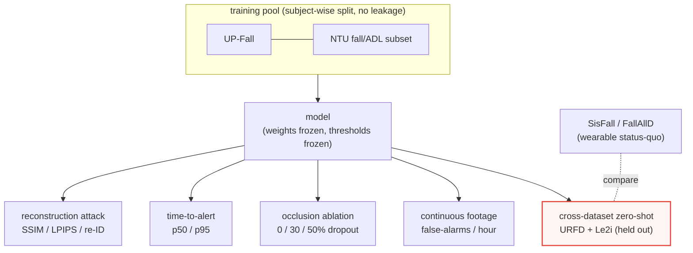
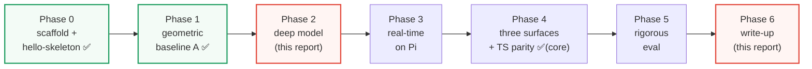

# Diagrams & Schematics

> Mermaid + ASCII schematics for the manuscript and slides. Mermaid blocks render
> natively in GitHub, VS Code (with the Markdown Preview Mermaid extension), and
> most IEEE-friendly Markdown tooling. Each diagram pairs with a rendered PNG in
> [`../figures/`](../figures/) where a publication-grade raster is needed.

**Index**

1. [System architecture & the privacy boundary](#1-system-architecture--the-privacy-boundary)
2. [Edge pipeline (capture → alert)](#2-edge-pipeline-capture--alert)
3. [The frame-egress = 0 invariant](#3-the-frame-egress--0-invariant)
4. [Deep network (confidence-gated CTR-GCN)](#4-deep-network-confidence-gated-ctr-gcn)
5. [Spatial-temporal skeleton graph](#5-spatial-temporal-skeleton-graph)
6. [Confidence gating & temporal imputation](#6-confidence-gating--temporal-imputation)
7. [Alarm state machine (debounce + latch)](#7-alarm-state-machine-debounce--latch)
8. [Three surfaces & cross-language parity](#8-three-surfaces--cross-language-parity)
9. [Evaluation protocol](#9-evaluation-protocol)
10. [Build phases (research roadmap)](#10-build-phases-research-roadmap)

---

## 1. System architecture & the privacy boundary

> Rendered figure: [`figures/fig1_system_architecture.png`](../figures/fig1_system_architecture.png)



**Reading it:** raw video exists only inside the green box. The only thing that
ever crosses the WebSocket is a compact skeleton-telemetry record — never a
pixel. The shared `core/` library is reused server-side and re-implemented in
TypeScript so the dashboard can re-score recorded streams for clinical audit.

---

## 2. Edge pipeline (capture → alert)

> The per-frame hot path that runs on the device. Mirrors
> [`edge/run.py`](../../edge/run.py).



> The classifier runs on a **stride** (every Nth frame) over the rolling window,
> not every frame — that is the compute saving that keeps the Pi at 25–30 FPS
> (research doc §7).

---

## 3. The frame-egress = 0 invariant

> Companion to [`docs/PRIVACY.md`](../../docs/PRIVACY.md). The privacy claim is
> *architectural*: there is no code path from a pixel buffer to the wire.



Enforcement (research doc §9, `docs/PRIVACY.md`):

- **Static audit** — assert no frame buffer reaches any serialization / WS path.
- **Runtime audit** — assert zero pixel bytes on the wire.
- **Reconstruction attack** — train a keypoints→image decoder; report
  `SSIM < 0.15`, `LPIPS > 0.6`, low re-ID accuracy → telemetry is non-recoverable.

The unit test `test_wire_carries_no_pixels` already asserts the wire record's
keys are exactly `{node_id, ts, keypoints, fall_score, event}`.

---

## 4. Deep network (confidence-gated CTR-GCN)

> Rendered figure: [`figures/fig2_network_architecture.png`](../figures/fig2_network_architecture.png) ·
> Full spec: [`../network/architecture_spec.md`](../network/architecture_spec.md)



CTR-GC block internals (the topology-refinement novelty):

```
   x ──► shared topology  Â_k  (static skeleton graph, k = self/centripetal/centrifugal)
   x ──► channel refine   ΔA = Conv( tanh( φ1(x)_i − φ2(x)_j ) )
                          Â_refined = Â_k + α·ΔA      (α init 0 → starts at ST-GCN)
   out = Σ_k  Â_refined · (x · W_k)   ─►  multi-scale temporal conv  ─►  + residual
```

---

## 5. Spatial-temporal skeleton graph

> Rendered figure: [`figures/fig3_spatiotemporal_graph.png`](../figures/fig3_spatiotemporal_graph.png)

COCO-17 joints (indices match `core/eldercare/schema.py`):

```
                 0 nose
        1 eye ─  ●  ─ 2 eye
      3 ear ●         ● 4 ear
                 │
     5 ●━━━━━━━━━┻━━━━━━━━━● 6      shoulders
       ┃                   ┃
     7 ●                   ● 8      elbows
       ┃                   ┃
     9 ●                   ● 10     wrists
              11 ●━━━● 12          hips
                 ┃   ┃
             13 ●     ● 14          knees
                 ┃   ┃
             15 ●     ● 16          ankles
```

Each bone is a spatial edge. The graph is **replicated over the T frames** of the
window, and the *same joint in consecutive frames* is joined by a temporal edge —
this 2-D (joints × time) lattice is the domain the network convolves over.



---

## 6. Confidence gating & temporal imputation

> Rendered figure: [`figures/fig4_confidence_gating.png`](../figures/fig4_confidence_gating.png) ·
> Code: [`ConfidenceGate`](../network/reference_model.py),
> [`SlidingWindow.as_tensor`](../../core/eldercare/temporal/__init__.py)



A blanket over the legs for 10 frames no longer collapses those joints to the
origin; they are carried from the nearest visible frame, and the network learns
(via the reliability scalar) how much to trust each joint.

---

## 7. Alarm state machine (debounce + latch)

> Rendered figure: [`figures/fig10_alarm_state_machine.png`](../figures/fig10_alarm_state_machine.png) ·
> Code: [`AlarmState`](../../core/eldercare/alarm.py)

```mermaid
stateDiagram-v2
    [*] --> ARMED
    ARMED --> COUNTING: EMA(P) ≥ τ
    COUNTING --> ARMED: EMA(P) < τ
    COUNTING --> LATCHED: k of last m frames ≥ τ  / emit FALL
    LATCHED --> ARMED: EMA(P) < τ  (re-arm; never re-fires while still down)
    LATCHED --> LATCHED: EMA(P) ≥ τ  (stay latched, silent)
```

This converts a noisy per-frame probability into **exactly one** debounced alert
per fall episode (unit tests `test_alarm_fires_once_on_sustained_fall`,
`test_alarm_debounces_single_spike`). The `(τ, ema_alpha, k, m)` tuple is the
single knob for the sensitivity ↔ false-alarm-rate trade-off.

---

## 8. Three surfaces & cross-language parity



The browser re-implements the critical hot path so a clinician can replay and
**re-score recorded skeleton streams without a round-trip** and audit *why* an
alert fired. Golden-vector fixtures keep Python and TypeScript byte-for-byte
identical.

---

## 9. Evaluation protocol



- **Headline:** cross-dataset zero-shot F1 (report Fig. 8).
- **Deployment cost:** false-alarms/hour and the operating curve (Fig. 6).
- **Robustness:** occlusion ablation (Fig. 9), time-to-alert (Fig. 7).
- **Privacy:** reconstruction attack (non-recoverability).

---

## 10. Build phases (research roadmap)

> Source: [`ROADMAP.md`](../../ROADMAP.md). ✅ = implemented in the repo today.



The MVP (Phases 0–1) runs end-to-end today; this report delivers the Phase-2
network design and the Phase-6 figures/write-up, leaving training and on-device
deployment as the clearly-scoped remaining work.
